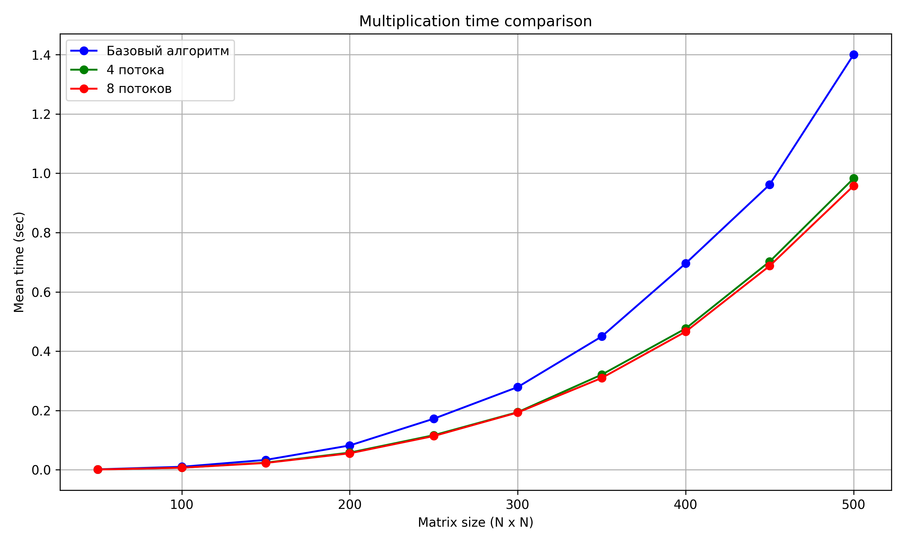

## Отчет по лабораторной работе №2 

### Задание на лабораторную работу: 
   Написать программу на языке C/C++ для перемножения двух матриц.
Исходные данные: файл(ы) содержащие значения исходных матриц.
Выходные данные: файл со значениями результирующей матрицы, время
выполнения, объем задачи.
Обязательна автоматизированная верификация результатов вычислений с помощью
сторонних библиотек или стороннего ПО (например на Matlab/Python).

### Файлы:
* [multiply.cpp](multiply.cpp) - создает файлы с матрицами, профводит умножение и сохраняет время выполнения
* [check.py](check.py) - проверяет корректность умножения с помощью numpy и строит график зависимости времени умножения от размера матриц
* [input](input) - папка со всеми сгенерированными матрицами и результатами их перемножения. Не добавлена в репозиторий в силу огромного количества файлов
* [timing_results_#tr.txt](timing_results.txt) - файл, содержащий размеры матриц и среднее (из 10 экспериментов) время их перемножения в 4 и 8 потоков соответсвенно
* [script.ps1](script.ps1) - точка входа в программу. Запустит последовательно создание-умножение и проверку. Результат можно будет увидеть в check.log

### Специфика
Максимальный размер матриц задается константами в файлах multiply.cpp и check.py, он должен совпадать
Для распараллеливания умножения матриц были использованы:

#pragma omp parallel num_threads(4/8) директива запускает параллельный регион с 4/8 потоками.
#pragma omp for директива говорит OpenMP распределить итерации цикла по потокам.
#pragma omp simd reduction(+:sum) внутренний цикл выполняется с использованием SIMD-инструкций, ускоряя вычисления произведения элементов и накопление суммы..
  
### Результаты экспериментов и выводы: 
График: 

Вывод: Использование OpenMP ускорило выполнение вычислений. Чем больше размер умножаемых матриц, тем больше прирост производитльности. Теоретически применение параллелизма к матрицам малого размера могло бы привести к потере производительности, но здесь этого не наблюдается.
