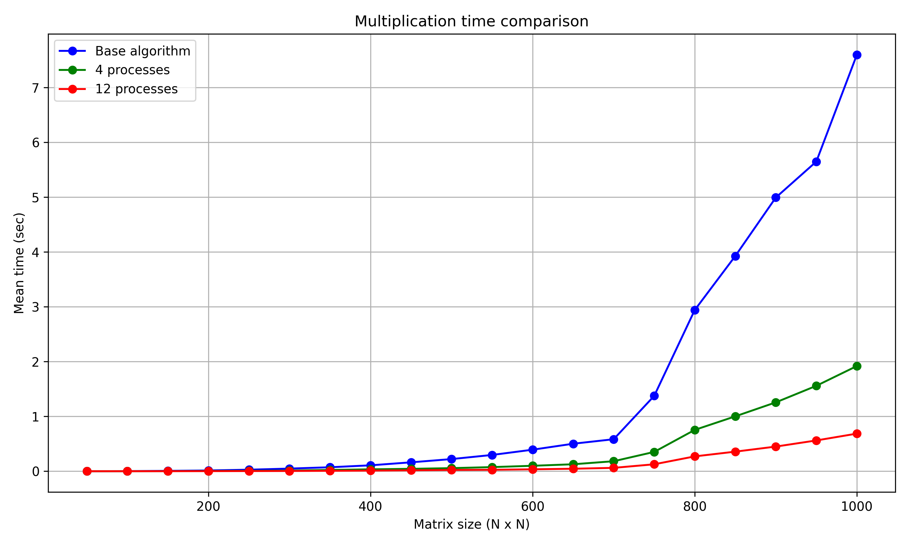

## Отчет по лабораторной работе №3 

### Задание на лабораторную работу: 
   Написать программу на языке C/C++ для перемножения двух матриц.
Исходные данные: файл(ы) содержащие значения исходных матриц.
Выходные данные: файл со значениями результирующей матрицы, время
выполнения, объем задачи.
Обязательна автоматизированная верификация результатов вычислений с помощью
сторонних библиотек или стороннего ПО (например на Matlab/Python).

### Файлы:
* [multiply.cpp](multiply.cpp) - создает файлы с матрицами, профводит умножение и сохраняет время выполнения
* [check.py](check.py) - проверяет корректность умножения с помощью numpy и строит график зависимости времени умножения от размера матриц
* [input](input) - папка со всеми сгенерированными матрицами и результатами их перемножения. Не добавлена в репозиторий в силу огромного количества файлов
* [timing_results_#.txt](timing_results.txt) - файл, содержащий размеры матриц и среднее (из 10 экспериментов) время их перемножения в 4 и 12 процессов соответсвенно
* [script.ps1](script.ps1) - точка входа в программу. Запустит последовательно создание-умножение и проверку. Результат можно будет увидеть в check.log
* [For_Korolev.cpp](For_Korolev.cpp) - вариант кода для отправки на суперкомпьютер

### Специфика
Максимальный размер матриц задается константами в файлах multiply.cpp и check.py, он должен совпадать
Была использована библиотека MPI (Message Passing Interface) для организации работы программы в несколько (4 и 12) процессов.
  
### Результаты экспериментов и выводы: 
График (на домашнием компьютере): 

График (на суперкомпьютере):

Вывод: Использование MPI ускорило выполнение вычислений. Чем больше размер умножаемых матриц, тем больше прирост производитльности. На суперкомпьютере алгоритм работает более стабильно и в общем значительно быстрее, что позволило протестировать большие размеры матриц.
