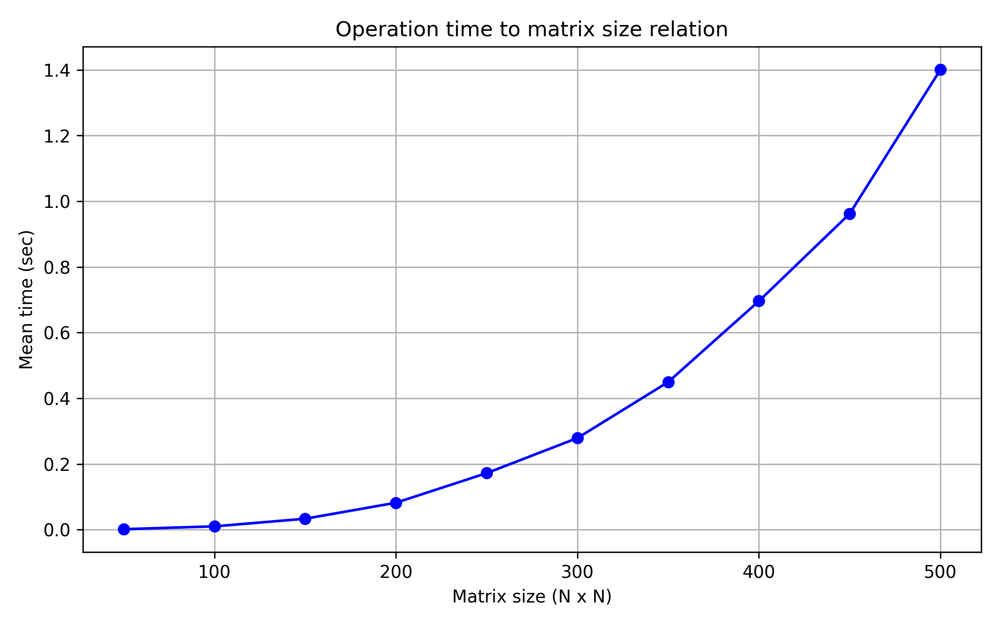

## Отчет по лабораторной работе №1 

### Задание на лабораторную работу: 
   Написать программу на языке C/C++ для перемножения двух матриц.
Исходные данные: файл(ы) содержащие значения исходных матриц.
Выходные данные: файл со значениями результирующей матрицы, время
выполнения, объем задачи.
Обязательна автоматизированная верификация результатов вычислений с помощью
сторонних библиотек или стороннего ПО (например на Matlab/Python).

### Файлы:
* [multiply.cpp](multiply.cpp) - создает файлы с матрицами, профводит умножение и сохраняет время выполнения
* [check.py](check.py) - проверяет корректность умножения с помощью numpy и строит график зависимости времени умножения от размера матриц
* [input](input) - папка со всеми сгенерированными матрицами и результатами их перемножения. Не добавлена в репозиторий в силу огромного количества файлов
* [timing_results.txt](timing_results.txt) - файл, содержащий размеры матриц и среднее (из 10 экспериментов) время их перемножения
* [script.ps1](script.ps1) - точка входа в программу. Запустит последовательно создание-умножение и проверку. Результат можно будет увидеть в check.log

### Специфика
Максимальный размер матриц задается константами в файлах multiply.cpp и check.py, он должен совпадать
  
### Результаты экспериментов и выводы: 
Статистика: 

|Размер|Среднее время, с|
|------------:|-------:|
|50x50	|0.001501|
|100x100|	0.010109|
|150x150|	0.033304|
|200x200|	0.082021|
|250x250|	0.172176|
|300x300|	0.278965|
|350x350|	0.449517|
|400x400|	0.696111|
|450x450|	0.961924|
|500x500|	1.400607|

График: 

Вывод: При увеличении размерности матриц, время умножения значительно увеличивается. Исходя из полученных даных, можно сделать вывод о кубическом росте времени выполнения алгоритма.
